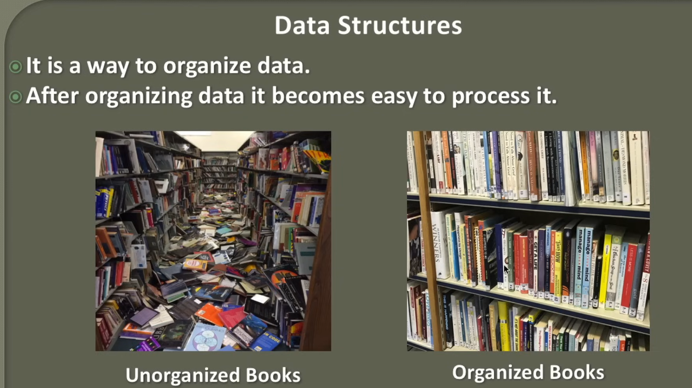
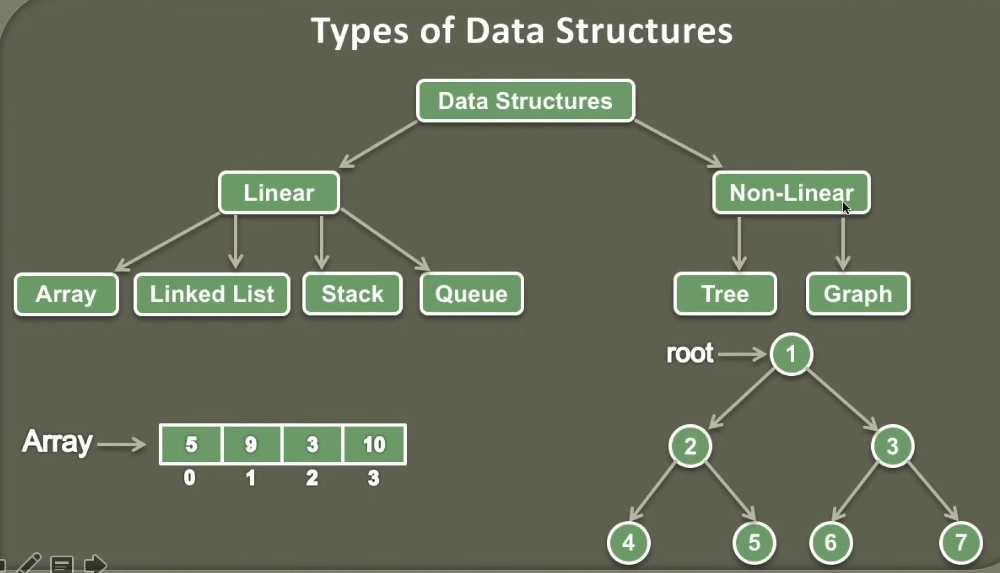
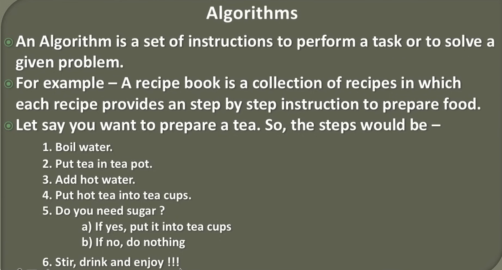
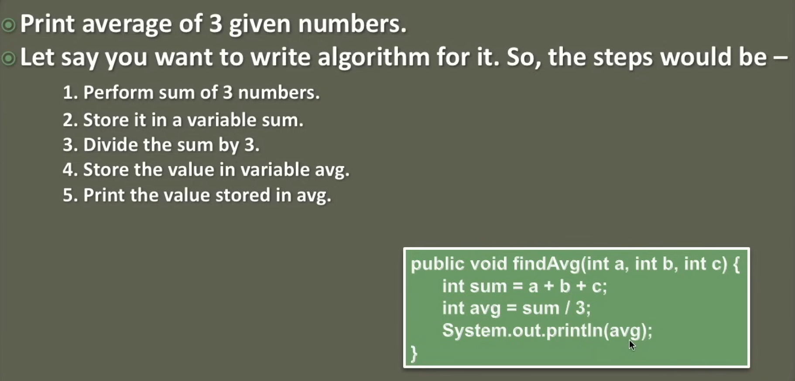
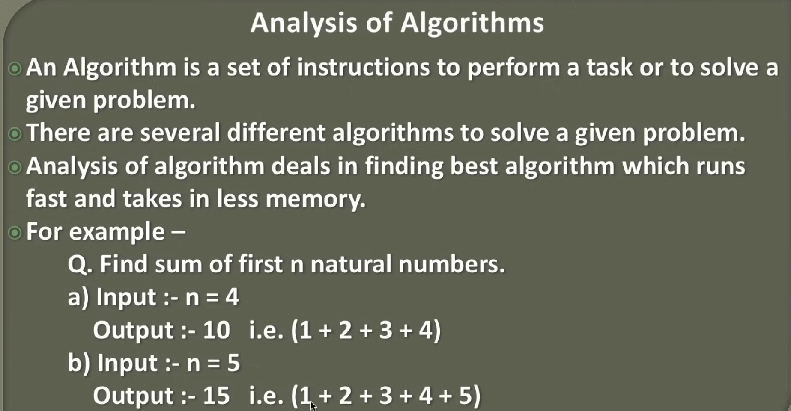
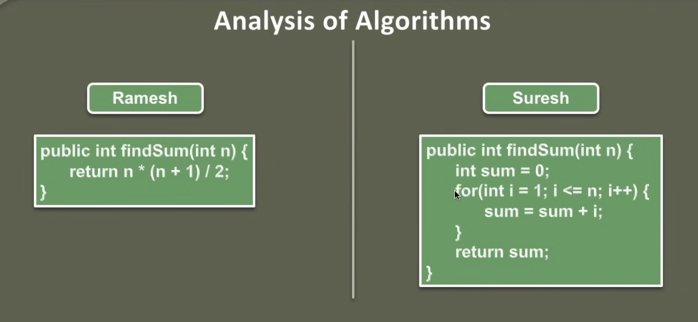
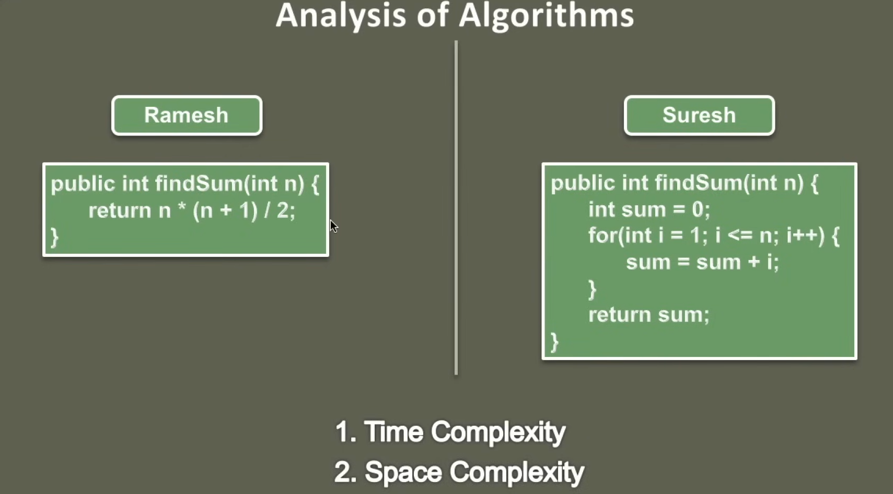
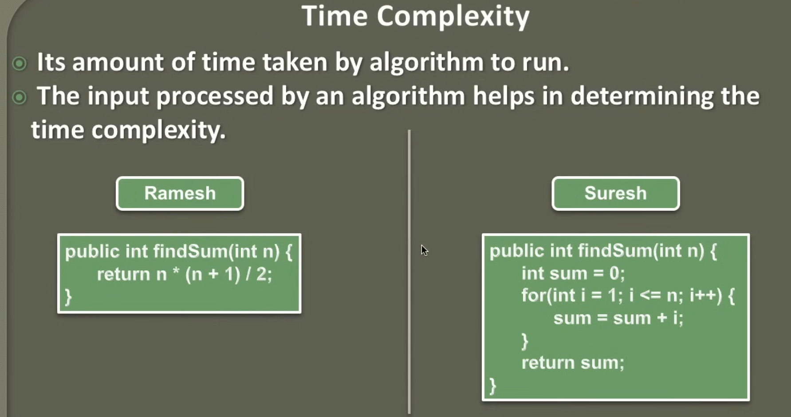
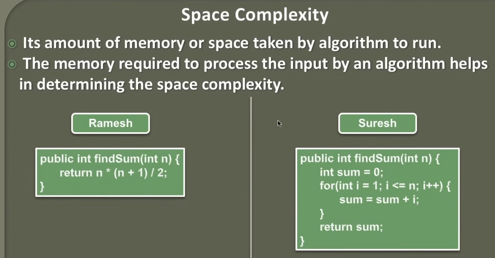

## Introduction to Data Structures



## Introduction to Algorithms



## Analysis of Algorithms




## Time Complexity


```java
public class TimeComplexity {

    public static void main(String[] args) {
        double now = System.currentTimeMillis();
        int n = 999999999;

        System.out.println(printSum(n));
        System.out.println("Time Taken " + (System.currentTimeMillis() - now) + "ms");

        double now2 = System.currentTimeMillis();
        System.out.println(printSum2(n));
        System.out.println("Time Taken " + (System.currentTimeMillis() - now2) + "ms");
    }

    public static int printSum(int n) {
        int sum = 0;
        for (int i = 1; i <= n; i++) {
            sum = sum + i;
        }
        return sum;
    }

    public static int printSum2(int n) {
        return n * (n + 1) / 2;
    }
}

```
```shell
-1243309312
Time Taken 285.0ms
904174336
Time Taken 0.0ms
```

## Space Complexity

